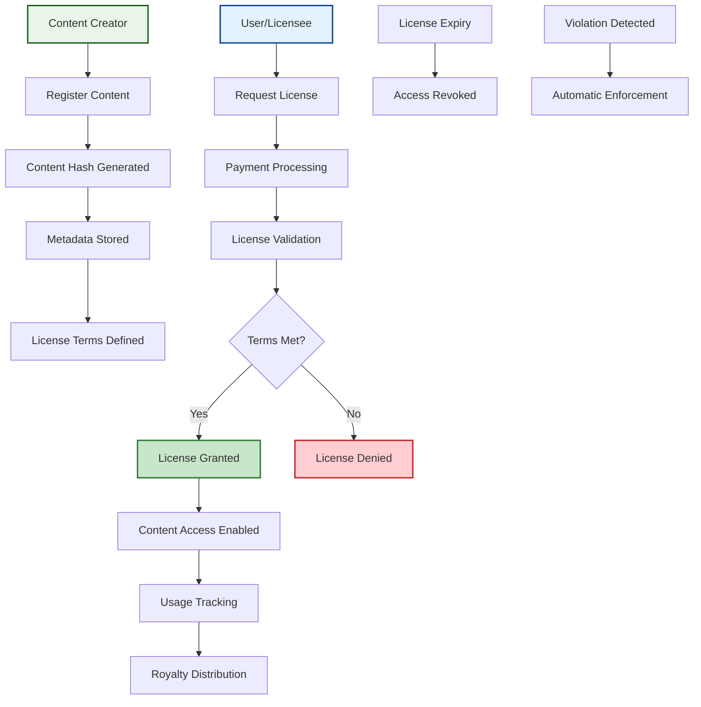

# Digital Rights Management (DRM) Module

The Digital Rights Management (DRM) module represents one of INTAGIUM's most innovative features, providing a comprehensive solution for managing digital content rights, licensing, and royalty distribution on-chain. Unlike traditional DRM systems that rely on centralized authorities and proprietary technologies, INTAGIUM's DRM module leverages blockchain technology to create transparent, immutable, and globally accessible rights management infrastructure.

## Overview

The DRM module addresses the fundamental challenges faced by content creators, distributors, and consumers in the digital economy. Content creators struggle with protecting their intellectual property, tracking usage, and ensuring fair compensation for their work. Distributors need reliable systems for managing licenses and ensuring compliance with usage terms. Consumers require transparent and fair access to digital content without restrictive or opaque licensing terms.

At its core, the DRM module enables content creators to register their digital assets on the blockchain, define usage terms and licensing conditions, and automatically enforce these terms through smart contract logic. The system supports various content types including text, images, audio, video, software, and any other digital asset that can be uniquely identified through cryptographic hashing.

## DRM Module Flow




- **[DRM Flow Digramm](/flowdigramm/drm-flow)** - DRM Flow Digramm 

## Key Features

### Content Registration and Verification
The DRM module provides robust content registration capabilities that create immutable records of digital assets on the blockchain. When content is registered, the system generates a unique content identifier based on cryptographic hashing of the content data, ensuring that the registration is tamper-proof and verifiable.

### Flexible Licensing Framework
The module supports a wide range of licensing models to accommodate different business needs and content types. Creators can define licensing terms including:
- Usage duration and geographic restrictions
- User limits and modification permissions
- Redistribution rights and revenue sharing
- Exclusive and non-exclusive licensing options

### Automated Royalty Distribution
One of the most powerful features of the DRM module is its ability to automatically distribute royalties to content creators and other stakeholders based on predefined rules. When content is accessed or used, the system automatically calculates and distributes payments according to the licensing agreement.

### Cross-Platform Compatibility
The DRM module is designed to work across different platforms and applications, providing a universal rights management layer that can be integrated into various content distribution systems.

### Granular Permission Controls
The system provides fine-grained control over content access and usage permissions. Creators can specify exactly how their content can be used, by whom, and under what conditions.

### Audit Trail and Transparency
All content registration, licensing, and usage activities are recorded on the blockchain, creating a complete and immutable audit trail.

## Message Types

### MsgRegisterContent
Enables content creators to register new digital assets on the blockchain.

```go
type MsgRegisterContent struct {
    Creator      string            `json:"creator"`
    ContentHash  string            `json:"content_hash"`
    ContentType  string            `json:"content_type"`
    Title        string            `json:"title"`
    Description  string            `json:"description"`
    LicenseTerms LicenseTerms      `json:"license_terms"`
    Metadata     map[string]string `json:"metadata"`
}
```

### MsgCreateLicense
Allows users to request licenses for registered content.

```go
type MsgCreateLicense struct {
    Licensee    string            `json:"licensee"`
    ContentId   string            `json:"content_id"`
    LicenseType string            `json:"license_type"`
    Duration    int64             `json:"duration"`
    Payment     sdk.Coins         `json:"payment"`
    Terms       map[string]string `json:"terms"`
}
```

### MsgTransferRights
Enables content creators to transfer ownership rights to other parties.

### MsgUpdateLicense
Allows for modifications to existing licenses, such as extending duration or changing terms.

### MsgRevokeLicense
Enables content creators to revoke licenses in cases of violation or non-payment.

## Query Types

### QueryContent
Retrieves detailed information about registered content, including metadata, creator information, and licensing terms.

### QueryLicense
Retrieves information about specific licenses, including terms, duration, and payment status.

### QueryContentByCreator
Returns all content registered by a specific creator.

### QueryLicensesByLicensee
Returns all licenses held by a specific user.

### QueryRoyaltyDistribution
Retrieves information about royalty payments and distribution history.

## CLI Commands

### Register Content
```bash
# Register new content
intagiumd tx drm register-content \
  --creator intag1abc123def456ghi789jkl012mno345pqr678st \
  --content-hash "sha256:a1b2c3d4e5f6..." \
  --content-type "image" \
  --title "Digital Artwork #1" \
  --description "Original digital artwork created in 2024" \
  --license-type "commercial" \
  --price "1000000intag" \
  --duration "365" \
  --from my-wallet \
  --chain-id intagium-testnet-1
```

### Create License
```bash
# Create a license for content
intagiumd tx drm create-license \
  --licensee intag1def456ghi789jkl012mno345pqr678stabc123 \
  --content-id "content_12345" \
  --license-type "standard" \
  --duration "30" \
  --payment "500000intag" \
  --from user-wallet \
  --chain-id intagium-testnet-1
```

### Query Content
```bash
# Query specific content
intagiumd query drm content content_12345

# Query content by creator
intagiumd query drm content-by-creator intag1abc123def456ghi789jkl012mno345pqr678st

# Query royalty distribution
intagiumd query drm royalties content_12345 --from-date "2024-01-01"
```

### Transfer Rights
```bash
intagiumd tx drm transfer-rights \
  --content-id "content_12345" \
  --new-owner intag1ghi789jkl012mno345pqr678stabc123def456 \
  --transfer-type "complete" \
  --from creator-wallet \
  --chain-id intagium-testnet-1
```

### Revoke License
```bash
# Revoke a license
intagiumd tx drm revoke-license \
  --license-id "license_67890" \
  --reason "violation" \
  --from creator-wallet \
  --chain-id intagium-testnet-1
```

## Use Cases

### Digital Art and NFTs
- Register digital artwork with licensing terms
- Automatic royalty distribution on secondary sales
- Granular usage permissions for different license types
- Cross-platform compatibility for NFT marketplaces

### Software Licensing
- Register software packages with usage terms
- Time-limited licenses with automatic expiration
- Feature-based licensing with granular permissions
- Integration with software distribution platforms

### Music and Media Rights
- Register music tracks with performance rights
- Automatic royalty distribution to artists and labels
- Geographic licensing restrictions
- Integration with streaming platforms

### Educational Content
- Register educational materials with usage terms
- Institutional licensing for schools and universities
- Student access controls and time limits
- Integration with learning management systems

### Patent and Trademark Licensing
- Register intellectual property with licensing terms
- Complex multi-party licensing arrangements
- Automatic royalty calculations and distributions
- Integration with legal and compliance systems


### Genesis Settings

The DRM module includes configurable genesis parameters that define the initial state and operational parameters of the rights management system. These settings can be adjusted through governance proposals to adapt to changing needs and market conditions.

```json
{
  "drm": {
    "params": {
      "registration_fee": "1000000",
      "license_fee_percentage": "5",
      "max_license_duration": "31536000",
      "min_royalty_percentage": "1",
      "max_royalty_percentage": "50",
      "content_retention_period": "157680000"
    },
    "registered_content": [],
    "active_licenses": [],
    "royalty_pools": []
  }
}
```


## Integration Examples

### Web3 Integration
```javascript
const { ethers } = require('ethers');

// Connect to INTAGIUM
const provider = new ethers.JsonRpcProvider('https://web3.testnet.intagium.com');
const wallet = new ethers.Wallet(privateKey, provider);

// Register content (example using custom contract)
async function registerContent(contentHash, title, licenseTerms) {
    const tx = await drmContract.registerContent(
        contentHash,
        title,
        licenseTerms,
        { gasLimit: 200000 }
    );
    
    const receipt = await tx.wait();
    console.log('Content registered:', receipt.transactionHash);
}
```

### REST API Integration
```bash
# Query content via REST API
curl -X GET "https://api.testnet.intagium.com/intagium/drm/v1/content/content_12345"

# Create license via REST API
curl -X POST "https://api.testnet.intagium.com/intagium/drm/v1/licenses" \
  -H "Content-Type: application/json" \
  -d '{
    "licensee": "intag1def456ghi789jkl012mno345pqr678stabc123",
    "content_id": "content_12345",
    "license_type": "standard",
    "duration": "30",
    "payment": "500000intag"
  }'
```

## Best Practices

### Content Registration
- Use strong cryptographic hashes for content identification
- Include comprehensive metadata for better discoverability
- Set clear and enforceable licensing terms
- Consider future licensing needs when setting initial terms

### License Management
- Regularly monitor license compliance
- Set appropriate pricing for different license types
- Use automated renewal options where appropriate
- Maintain clear communication with licensees

### Security Considerations
- Protect private keys used for content registration
- Use multi-signature wallets for high-value content
- Regularly audit licensing agreements
- Implement proper access controls for content management

## Parameters and Configuration

The DRM module includes configurable parameters that can be adjusted through governance:

```json
{
  "registration_fee": "1000000",
  "license_fee_percentage": "5",
  "max_license_duration": "31536000",
  "min_royalty_percentage": "1",
  "max_royalty_percentage": "50",
  "content_retention_period": "157680000"
}
```

## Troubleshooting

### Common Issues

**"Content already registered"**
- Check if the content hash already exists in the system
- Verify that you're using the correct content hash

**"Insufficient funds for license"**
- Ensure your account has enough INTAG tokens
- Check the license price and fees

**"License expired"**
- Renew the license before expiration
- Check license duration and renewal terms

**"Unauthorized transfer"**
- Verify that you own the content rights
- Check transfer permissions and restrictions

## Next Steps

- **[DOR Module](/modules/dor)** - Learn about asset ownership registry
- **[EDM Module](/modules/edm)** - Explore data management capabilities
- **[API Documentation](/api/overview)** - Integrate DRM functionality
- **[Sample Applications](/samples/drm-integration)** - See real-world examples
- **[DRM Flow Digramm](/flowdigramm/drm-flow)** - DRM Flow Digramm 

## Support and Community

- **[Discord](https://discord.gg/intagium)** - Get help from the community
- **[GitHub](https://github.com/amrae1/INTAGIUM)** - Report issues and contribute
- **[Developer Tools](/developer-tools/cli)** - Access development resources

