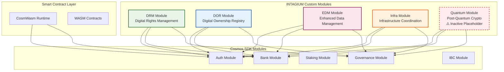

# Modules Overview

INTAGIUM's modular architecture is one of its most powerful features, enabling specialized functionality through purpose-built modules that extend the core Cosmos SDK capabilities. Each module is designed to address specific use cases while maintaining seamless integration with other modules and the broader ecosystem.

## Active Modules

INTAGIUM currently includes four active specialized modules, each serving distinct but complementary purposes:

### Digital Rights Management (DRM)
The DRM module provides comprehensive solution for managing digital content rights, licensing, and royalty distribution on-chain. It enables content creators to register their digital assets, define usage terms, and automatically enforce licensing conditions through smart contract logic.

**Key Features:**
- Content registration and verification
- Flexible licensing framework
- Automated royalty distribution
- Cross-platform compatibility
- Granular permission controls

**Use Cases:**
- Digital content licensing
- Intellectual property protection
- Automated royalty payments
- Multi-party content agreements

**[Learn More →](/modules/drm)**

### Digital Ownership Registry (DOR)
The DOR module serves as INTAGIUM's universal asset registration and ownership tracking system, providing transparent and immutable ownership records for digital and tokenized real-world assets.

**Key Features:**
- Universal asset registration
- Immutable ownership history
- Automated transfer mechanisms
- Auction and marketplace support
- Integration with external systems

**Use Cases:**
- NFT marketplaces and trading
- Domain name registration
- Real estate tokenization
- Collectibles authentication
- Supply chain tracking

**[Learn More →](/modules/dor)**

### Enhanced Data Management (EDM)
The EDM module provides sophisticated data storage, delivery, and access control capabilities in a decentralized environment, addressing critical challenges of data privacy and security.

**Key Features:**
- Secure data delivery
- Granular access controls
- Encryption and privacy protection
- Version management
- Analytics and reporting

**Use Cases:**
- Secure document sharing
- Encrypted communications
- Data compliance management
- Enterprise data solutions
- Financial data security
- Research data sharing
- Legal document management

**[Learn More →](/modules/edm)**

### Infrastructure  (Infra)
The Infra module enables decentralized coordination of physical and digital infrastructure resources, providing a framework for resource sharing and management across various use cases.

**Key Features:**
- Decentralized node registration
- Resource slot reservation
- Usage tracking and rewards
- Multi-use case support
- Automated coordination

**Use Cases:**
- Drone network coordination
- Mail delivery systems
- Street infrastructure management
- Compute resource sharing
- WiFi network management

**[Learn More →](/modules/infra)**

### Web3 Compatibility Layer

The Web3 Compatibility Layer provides seamless interoperability with the Ethereum ecosystem while maintaining INTAGIUM's advanced capabilities and performance benefits.

**Key Features:**
- Complete JSON-RPC API compatibility
- MetaMask integration
- Smart contract deployment
- Event system compatibility
- Transaction format translation
- Gas model adaptation

**Use Cases:**
- Ethereum DApp migration
- Cross-chain applications
- Web3 wallet integration
- Smart contract deployment
- Multi-chain development

**[Learn More →](/modules/web3-compatibility)**

### Governance Module

The Governance module provides INTAGIUM's decentralized decision-making framework, enabling community-driven evolution of the platform through transparent voting mechanisms.

**Key Features:**
- Community-driven decision making
- Token-weighted voting
- Flexible proposal types
- Transparent process
- Automatic execution
- Parameter management

**Use Cases:**
- Protocol upgrades
- Parameter adjustments
- Module activation/deactivation
- Treasury management
- Community initiatives

**[Learn More →](/modules/governance)**

### Smart Contracts (CosmWasm)

INTAGIUM includes comprehensive support for smart contracts through the CosmWasm runtime, providing a secure, efficient, and developer-friendly platform for building decentralized applications.

**Key Features:**
- Rust-based development
- WebAssembly execution
- Module integration
- Enhanced security
- Cross-platform compatibility
- Rich ecosystem

**Use Cases:**
- Decentralized applications
- Automated workflows
- Complex business logic
- Cross-module interactions
- Custom token implementations

**[Learn More →](/modules/smart-contracts)**

## Inactive Modules

### Quantum Module
The Quantum module is currently inactive but represents INTAGIUM's forward-thinking approach to post-quantum cryptography. This module can be activated through governance when quantum-resistant algorithms become necessary.

**Future Capabilities:**
- Post-quantum cryptographic algorithms
- Quantum-resistant key management
- Migration tools for existing data
- Compatibility with quantum computing advances

**[Learn More →](/modules/quantum)**

## Module Architecture

INTAGIUM's modules are built on the Cosmos SDK framework, which provides a robust foundation for modular blockchain development. Each module operates independently while sharing common infrastructure for state management, transaction processing, and inter-module communication.



### Modular Design Principles

**Interoperability**: Each module is designed to work seamlessly with other modules and the core Cosmos SDK functionality. Modules can share data and trigger actions across the ecosystem.

**Governance Control**: Modules can be activated, deactivated, or modified through INTAGIUM's governance system, ensuring that the platform can evolve based on community needs.

**Extensibility**: The modular architecture allows for new modules to be added without disrupting existing functionality, enabling continuous innovation and adaptation.

**Standards Compliance**: All modules follow consistent design patterns and API standards, making integration and development predictable and efficient.

### Common Module Features

All INTAGIUM modules share certain common characteristics:

**Message Types**: Each module defines specific message types that enable users to interact with module functionality through transactions.

**Query Types**: Comprehensive query capabilities allow users to retrieve information and monitor module state.

**Keeper Functions**: Core business logic is implemented in keeper functions that handle validation, state changes, and cross-module interactions.

**CLI Commands**: Command-line interfaces provide direct access to module functionality for developers and power users.

**REST APIs**: RESTful APIs enable integration with web applications and external systems.

**Genesis Configuration**: Configurable parameters allow customization of module behavior and operational limits.

## Integration Patterns

### Cross-Module Interactions

INTAGIUM's modules are designed to work together, creating powerful combinations of functionality:

**DRM + DOR Integration**: Content registered in the DRM module can be tokenized as assets in the DOR module, enabling complex licensing and ownership arrangements.

**EDM + DRM Integration**: The EDM module can provide secure storage and delivery for DRM-protected content, ensuring that licensing terms are enforced at the data level.

**Infra + All Modules**: The Infrastructure module can coordinate resources needed by other modules, such as storage nodes for EDM or distribution networks for DRM.

### External System Integration

Each module provides comprehensive APIs for integration with external systems:

**REST APIs**: Standard HTTP APIs for web application integration
**gRPC APIs**: High-performance APIs for system-to-system communication
**WebSocket APIs**: Real-time APIs for live updates and notifications
**CLI Tools**: Command-line interfaces for scripting and automation

## Development and Customization

### Module Development

INTAGIUM's modular architecture enables developers to create custom modules for specific use cases:

**Module SDK**: Comprehensive development kit for creating new modules
**Testing Framework**: Tools for testing module functionality and integration
**Documentation Templates**: Standardized documentation patterns for new modules
**Deployment Tools**: Automated deployment and governance integration

### Configuration Management

Each module includes extensive configuration options:

**Genesis Parameters**: Initial configuration settings for module deployment
**Runtime Parameters**: Settings that can be modified through governance
**Feature Flags**: Toggles for enabling or disabling specific functionality
**Integration Settings**: Configuration for external system connections

## Performance and Scalability

### Optimization Strategies

INTAGIUM's modules are designed for high performance and scalability:

**Efficient State Management**: Optimized data structures and storage patterns
**Parallel Processing**: Support for concurrent operations where possible
**Caching Layers**: Intelligent caching to reduce blockchain queries
**Batch Operations**: Support for processing multiple operations efficiently

### Monitoring and Analytics

Comprehensive monitoring capabilities are built into each module:

**Performance Metrics**: Real-time performance monitoring and alerting
**Usage Analytics**: Detailed analytics on module usage and performance
**Health Checks**: Automated health monitoring and diagnostics
**Audit Trails**: Complete audit logs for compliance and debugging

## Getting Started with Modules

### Prerequisites

Before working with INTAGIUM modules, ensure you have:

- INTAGIUM node running and synchronized
- CLI tools installed and configured
- Test tokens for transaction fees
- Basic understanding of blockchain concepts

### Basic Module Interaction

```bash
# Query module parameters
intagiumd query [module] params

# List available commands for a module
intagiumd tx [module] --help
intagiumd query [module] --help

# Check module status
intagiumd query [module] status
```

### Next Steps

Explore the detailed documentation for each module:

- **[DRM Module](/modules/drm)** - Digital Rights Management
- **[DOR Module](/modules/dor)** - Digital Ownership Registry  
- **[EDM Module](/modules/edm)** - Enhanced Data Management
- **[Infra Module](/modules/infra)** - Infrastructure Coordination
- **[Governance Module](/modules/governance)** - Governance
- **[CosmWasme](/modules/smart-contracts)** - Smart Contracts
- **[Quantum Module](/modules/quantum)** - Quantum Module
## Community and Support

### Contributing to Modules

INTAGIUM welcomes community contributions to module development:

- **Feature Requests**: Propose new functionality through GitHub issues
- **Bug Reports**: Report issues and help improve module stability
- **Code Contributions**: Submit pull requests for bug fixes and enhancements
- **Documentation**: Help improve module documentation and examples

### Getting Help

- **[Discord Community](https://discord.gg/intagium)** - Real-time community support
- **[GitHub Issues](https://github.com/amrae1/INTAGIUM/issues)** - Technical support and bug reports
- **[API Documentation](/api/overview)** - Detailed API references
- **[Developer Tools](/developer-tools/cli)** - Tools and utilities for development

The modular architecture of INTAGIUM provides a powerful foundation for building sophisticated blockchain applications. Each module addresses specific real-world challenges while maintaining the flexibility and interoperability needed for complex use cases.

